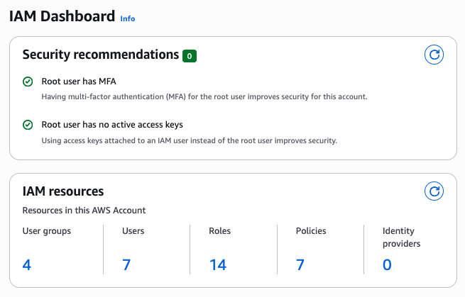
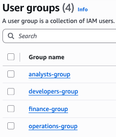
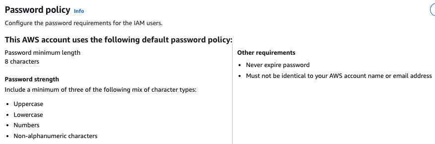

# AWS IAM Security Implementation

A comprehensive Identity and Access Management (IAM) security solution for a startup transitioning from manual AWS console management to Infrastructure as Code (IaC). This project demonstrates enterprise-grade security practices using three different IaC tools: CloudFormation, Terraform, and AWS CDK.

## 📋 Project Overview

### The Problem

A growing startup had significant security vulnerabilities in their AWS environment:

- **Shared root credentials** — All employees used the same root account login
- **No separation of duties** — Anyone could access any resource across departments
- **Zero audit trail** — No logging or tracking of who made what changes
- **Manual configuration** — All infrastructure created by hand in the AWS console
- **Offboarding risk** — No way to quickly revoke access when employees left

### The Solution

I designed and implemented a role-based access control (RBAC) system with:

- **4 IAM Groups** — Developers, Operations, Finance, and Analysts
- **Least-privilege policies** — Each group only has access to what they need
- **MFA enforcement** — All users required to enable multi-factor authentication
- **Strong password policy** — Enterprise-grade password requirements
- **Full audit capability** — CloudTrail integration for tracking all API calls
- **Infrastructure as Code** — Reproducible, version-controlled infrastructure

## 🏗️ Architecture


### Group Permissions Summary

| Group | Access Level |
|-------|--------------|
| Developers | EC2, Lambda, S3 (dev buckets), CloudWatch Logs |
| Operations | Full EC2, CloudWatch, Systems Manager |
| Finance | S3 billing bucket (read-only), Cost Explorer, Budgets |
| Analysts | DynamoDB (read-only), S3 data buckets (read-only), Athena |

## 🛠️ Technologies Used

- **AWS IAM** — Identity and Access Management
- **AWS CloudFormation** — AWS-native IaC
- **Terraform** — Multi-cloud IaC tool
- **AWS CDK (Python)** — Infrastructure using programming languages
- **AWS CloudTrail** — API activity logging
- **AWS CloudWatch** — Monitoring and alerting

## 📁 Project Structure

```
aws-iam-security-project/
├── architecture/
│   └── startupo-current-infrastructure.png
├── aws-cdk/
│   ├── app.py
│   ├── cdk_stack.py
│   ├── cdk.json
│   ├── requirements.txt
│   └── README.md
├── cloudformation/
│   └── iam-template.yaml
├── terraform/
│   ├── main.tf
│   ├── variables.tf
│   ├── outputs.tf
│   ├── provider.tf
│   ├── terraform.tfvars.example
│   └── README.md
├── docs/
│   ├── screenshots/
│   │   ├── 01-iam-groups-overview.png
│   │   ├── 02-iam-users-list.png
│   │   ├── 03-password-policy.png
│   │   ├── 04-developers-permissions.png
│   │   ├── 05-operations-permissions.png
│   │   ├── 06-finance-permissions.png
│   │   ├── 07-analysts-permissions.png
│   │   └── 08-policy-details-example.png
│   └── Project 1 - Identity and Access Management.pdf
├── MEDIUM.md
└── README.md
```

## 🚀 Deployment Options

This project includes three different IaC implementations. Choose based on your needs:

### Option 1: Terraform (Recommended)

```bash
cd terraform
cp terraform.tfvars.example terraform.tfvars
# Edit terraform.tfvars with your AWS account ID
terraform init
terraform plan
terraform apply
```

### Option 2: CloudFormation

```bash
cd cloudformation
aws cloudformation create-stack \
  --stack-name iam-security-stack \
  --template-body file://iam-template.yaml \
  --capabilities CAPABILITY_NAMED_IAM
```

### Option 3: AWS CDK (Python)

```bash
cd aws-cdk
python -m venv .venv
source .venv/bin/activate
pip install -r requirements.txt
cdk deploy
```

## 📸 Screenshots

### IAM Groups Overview


### IAM Users


### Password Policy


## 🔐 Security Features

### Least Privilege Access
Each group policy follows the principle of least privilege — users only have permissions necessary for their job function.

**Example: Finance Policy**
```json
{
  "Effect": "Allow",
  "Action": [
    "s3:GetObject",
    "s3:ListBucket"
  ],
  "Resource": [
    "arn:aws:s3:::company-billing-data",
    "arn:aws:s3:::company-billing-data/*"
  ]
}
```

### MFA Enforcement
All users must enable MFA before accessing AWS resources. The MFA policy denies all actions except IAM self-service until MFA is configured.

### Password Policy
- Minimum 14 characters
- Requires uppercase, lowercase, numbers, and symbols
- Password expiration every 90 days
- Prevents password reuse (last 24 passwords)

## 📝 Blog Post

For a detailed walkthrough of this project, read my Medium article:
https://medium.com/@elnala24/project-iam-security-using-iac-cloudformation-546ee94485e0

## 🧹 Cleanup

To avoid ongoing AWS charges, destroy the resources when done:

**Terraform:**
```bash
cd terraform
terraform destroy
```

**CloudFormation:**
```bash
aws cloudformation delete-stack --stack-name iam-security-stack
```

**CDK:**
```bash
cd aws-cdk
cdk destroy
```

## 📚 Lessons Learned

- **Groups over direct user policies** — Easier management, cleaner offboarding
- **IaC is essential** — Version control, reproducibility, and documentation in one
- **Least privilege takes planning** — Understanding each team's actual needs before writing policies
- **Multiple IaC tools have tradeoffs** — Terraform for multi-cloud, CDK for complex logic, CloudFormation for AWS-native

## 🔗 Connect

- [LinkedIn](https://www.linkedin.com/in/alantommyle/)
- [GitHub](https://github.com/elnala24)
- [Medium](https://medium.com/@elnala24)

## 📄 License

This project is open source and available under the MIT License.
