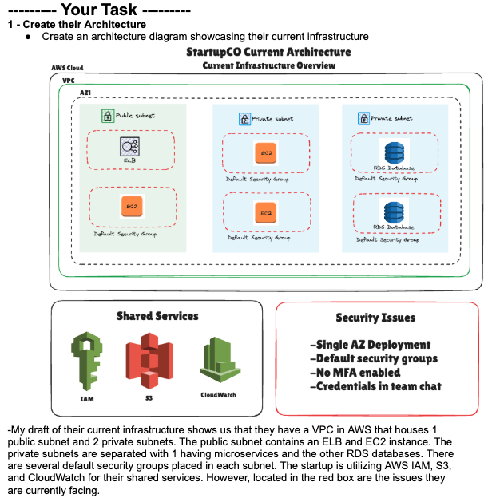

# AWS IAM Security Implementation for StartupCo

## 📋 Project Overview

This project implements a comprehensive Identity and Access Management (IAM) solution for StartupCo, a fast-growing tech startup with a fitness tracking application. The company was using shared root account credentials across their team, which posed significant security risks. This solution establishes proper IAM structure with role-based access control (RBAC), MFA enforcement, and security best practices.

## 🎯 Problem Statement

**Initial Security Issues:**
- All 10 employees sharing root account credentials
- No separation of duties or least privilege access
- No Multi-Factor Authentication (MFA) enabled
- Credentials shared via team chat
- Single availability zone deployment
- Default security groups in use

## 🏗️ Architecture

### Current Infrastructure


**Infrastructure Components:**
- **VPC** with 1 public subnet and 2 private subnets
- **Public Subnet:** Elastic Load Balancer (ELB) and EC2 instances
- **Private Subnets:** Microservices (Subnet 1) and RDS databases (Subnet 2)
- **Shared Services:** IAM, S3, CloudWatch

## 🔐 Security Solution Implemented

### IAM Structure

Created four IAM groups with role-based permissions:

1. **Developers Group** (4 users)
   - Full EC2 management access
   - S3 access for application files
   - CloudWatch logs viewing (read-only)

2. **Operations Group** (2 users)
   - Full EC2, RDS, and CloudWatch access
   - Systems Manager access
   - VPC and networking management

3. **Finance Group** (1 user)
   - Cost Explorer and AWS Budgets access
   - Read-only resource access for cost analysis
   - Billing dashboard access

4. **Analysts Group** (3 users)
   - Read-only S3 access to user data buckets
   - Read-only RDS access
   - CloudWatch metrics viewing

### Security Features

✅ **MFA Enforcement** - All users required to enable MFA before accessing resources  
✅ **Strong Password Policy** - 14+ characters, complexity requirements, 90-day rotation  
✅ **Least Privilege Access** - Users only have permissions needed for their role  
✅ **Root Account Secured** - MFA enabled, credentials stored securely  
✅ **Audit Logging** - CloudTrail enabled for tracking all IAM actions  

## 🛠️ Technologies Used

- **AWS IAM** - Identity and Access Management
- **AWS CloudFormation** - Infrastructure as Code
- **Terraform** - Alternative IaC implementation ✅
- **AWS CDK** - Alternative IaC implementation (coming soon)

## 📁 Repository Structure

```
aws-iam-security-project/
├── README.md                          # This file
├── architecture/
│   └── startupo-current-infrastructure.png
├── cloudformation/
│   ├── iam-template.yaml              # CloudFormation template
│   └── README.md                      # Deployment instructions
├── docs/
│   ├── Project 1 - Identity and Access Management.pdf
│   ├── security-decisions.md          # Why I made certain choices
│   └── screenshots/                   # Implementation screenshots
└── .gitignore
```

## 🚀 Deployment Instructions

### Prerequisites
- AWS Account with admin access
- AWS CLI installed and configured
- CloudFormation permissions

### Deploy via AWS Console

1. Navigate to **CloudFormation** in AWS Console
2. Click **Create Stack** → **With new resources**
3. Choose **Upload a template file**
4. Upload `cloudformation/iam-template.yaml`
5. Stack name: `startupo-iam-stack`
6. Click through and **Create Stack**

### Deploy via AWS CLI

```bash
aws cloudformation create-stack \
  --stack-name startupo-iam-stack \
  --template-body file://cloudformation/iam-template.yaml \
  --capabilities CAPABILITY_NAMED_IAM
```

### Set Password Policy

```bash
aws iam update-account-password-policy \
  --minimum-password-length 14 \
  --require-symbols \
  --require-numbers \
  --require-uppercase-characters \
  --require-lowercase-characters \
  --max-password-age 90 \
  --password-reuse-prevention 5 \
  --allow-users-to-change-password
```

## 📸 Screenshots

Screenshots of the implementation can be found in the `docs/screenshots/` directory:
- IAM Groups structure
- User permissions by group
- MFA enforcement policies
- Password policy configuration

## 🔑 Key Security Decisions

### Why MFA Enforcement?
MFA adds a critical second layer of security. Even if credentials are compromised, an attacker cannot access the account without the second factor.

### Why Separate Groups?
Role-based access control (RBAC) follows the principle of least privilege - users only get permissions necessary for their job function, reducing the blast radius of any security incident.

### Why Read-Only for Analysts?
Data analysts need to query and analyze data but don't need to modify infrastructure. Read-only access prevents accidental deletion or modification of critical data.

### Why No Root Account Usage?
The root account has unrestricted access to everything. Using IAM users with specific permissions limits damage from compromised credentials.

## 📚 What I Learned

- Implementing least privilege access at scale
- CloudFormation IAM policy syntax and best practices
- MFA enforcement using IAM condition keys
- The importance of separating duties in cloud environments
- How to structure Infrastructure as Code for maintainability

## 🔮 Future Improvements

- [ ] Implement AWS Organizations for multi-account structure
- [ ] Add AWS SSO/Identity Center for federated access
- [ ] Create Terraform and CDK implementations
- [ ] Add automated compliance checking with AWS Config
- [ ] Implement permission boundaries for additional security
- [ ] Add high availability across multiple AZs
- [ ] Replace default security groups with custom rules

## 🤝 Contributing

This is a portfolio project, but feedback is always welcome! Feel free to open an issue if you spot any security concerns or have suggestions for improvement.

## 📝 License

This project is open source and available for educational purposes.

## 👤 Author

**Alan**
- GitHub: https://github.com/elnala24
- LinkedIn: https://www.linkedin.com/in/alantommyle/
- Email: elnala24@gmail.com

---

*This project was completed as part of my AWS Cloud Computing bootcamp portfolio.*
